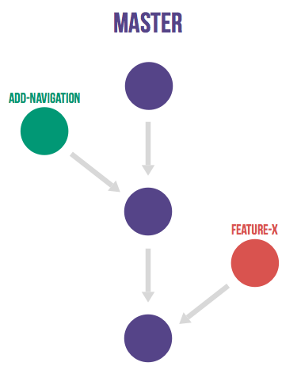

# 2. Gestion de version {bg=#2C3E50EE}

# 2.1 Pourquoi ?

Pourquoi faire de la gestion de version ?

* Retour en arrière
* Expérimentation possible
* Travail à plusieurs en parallèle

# 2.1 Outils

Outils de collaboration :

* [GitHub](https://github.com/)
* [Gitlab](https://gitlab.com/)
* [Bitbucket](https://bitbucket.org/)
* [Gogs](https://gogs.io/)

# 2.2 Bonnes pratiques

* Branches, plusieurs workflows possibles :
  * tout dans master 🤮
  * [gitflow](https://nvie.com/posts/a-successful-git-branching-model/)
  * master + branches de feature
  * n'importe quelle combinaison de tout ça
* Pull/merge requests & code review
* Branche master protégée

# 2.2 Bonnes pratiques

Messages de commit utiles !

# 2.3 Gitflow

# 2.4 GitHub Flow

